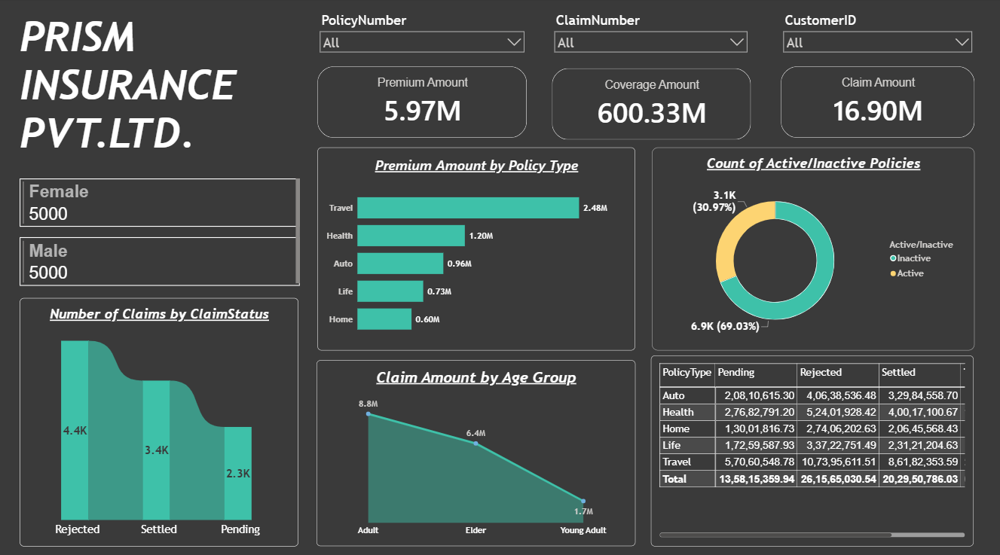

# Prism Insurance Dashboard (Power BI)

Interactive Power BI dashboard analyzing policies, premiums, and claims for Prism Insurance Pvt. Ltd.

## Key Metrics
- Premium Amount: 5.97M
- Coverage Amount: 600.33M
- Claim Amount: 16.90M
- Customers: 5,000 Female / 5,000 Male

## Insights
- Travel policies bring the highest premium (2.48M); Home the lowest (0.60M)
- ~69% of policies are active, ~31% inactive
- Rejected claims are the most common status (4.4K), followed by Settled (3.4K) and Pending (2.3K)
- Adults account for the highest claim amount (8.8M)

## Visuals
- Premium by policy type (bar)
- Active vs inactive policies (donut)
- Claims by status (area)
- Claim amount by age group (line)
- Claim status matrix by policy type

## Tools
Power BI, DAX, Excel
